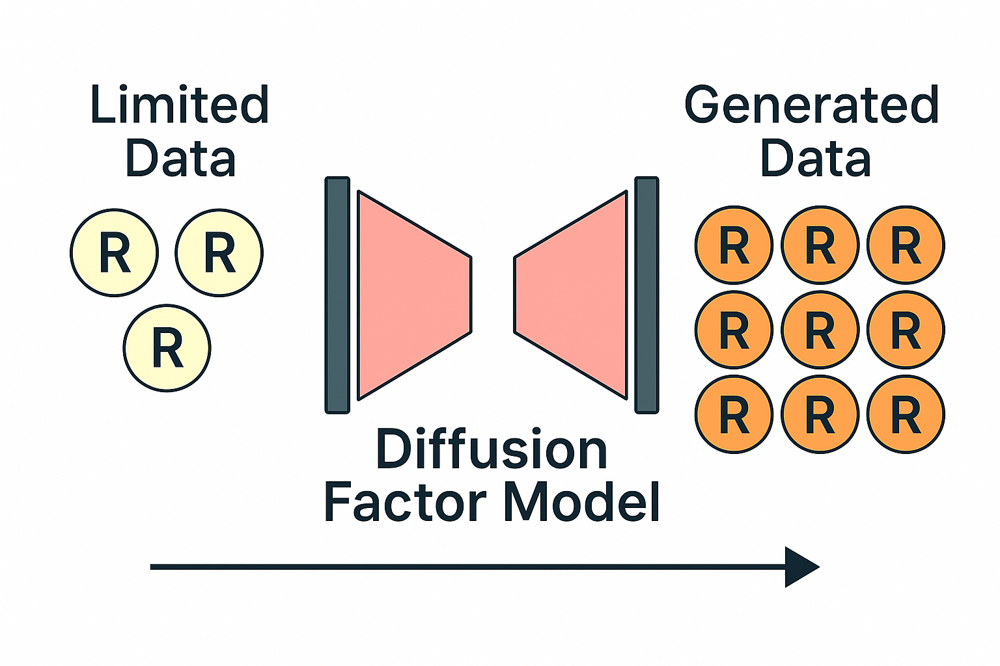
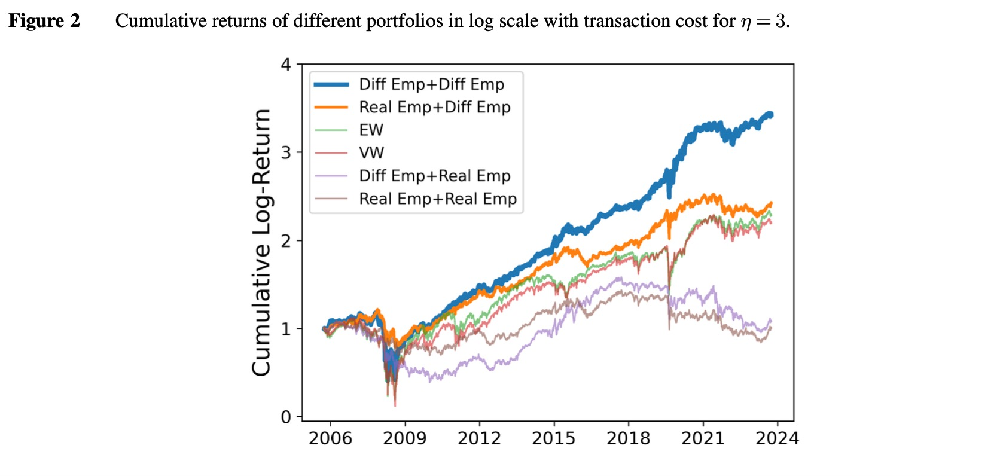

# 🌊 Diffusion Factor Model

<p align="center">
  
</p>

This repository implements a Diffusion Factor Model for financial data.

## 📝 Summary

Diffusion Factor Model (DFM) is a novel approach that adapts diffusion models to generate new financial returns with realistic factor structure. It achieves superior performance in preserving the statistical properties and latent factor patterns of financial data, making it valuable for portfolio optimization and risk management applications.

## ✨ Features

- 📊 Diffusion models adapted for financial data with factor structure
- 🔄 Support for both simulation data (num_samples, height, width) and empirical data (num_samples, length) formats
- 📐 Automatic adaptation to different input dimensions
- 💹 Portfolio optimization evaluation framework
- 📈 Factor recovery evaluation metrics

## 🔧 Installation

```bash
git clone https://github.com/xymmmm00/diffusion_factor_model.git
cd diffusion-factor-model
pip install -r requirements.txt
```

For portfolio optimization, MOSEK requires a license (free for academic use).

## 📁 Project Structure

```
diffusion-factor-model/
├── config/                      # Configuration settings
├── diffusion_factor_model/      # Core model implementation
├── eval/                        # Evaluation modules
├── simulation_experiment_data/  # Simulation data storage
├── empirical_analysis_data/     # Empirical data storage
├── model_results/               # Trained models (created automatically)
├── samples/                     # Generated samples (created automatically)
└── train.py                     # Main training script
```

## 🚀 Training

The training script automatically detects data format and adapts the model architecture accordingly.

```bash
# Train with simulation data:
python train.py --data_path /path/to/simulation_experiment_data/training_data_example.npy --seed 42 --gpu 0

# Train with empirical data:
python train.py --data_path /path/to/empirical_analysis_data/training_data_example.npy --seed 42 --gpu 0
```

### Supported Data Formats

1. **Empirical data**: Shape `(samples, assets)` - e.g., `(1024, 512)` 
2. **Simulation data**: Shape `(samples, height, width)` - e.g., `(512, 32, 64)`

## 📊 Evaluation

The repository includes evaluation modules for:

1. **Mean and Covariance Calculation** - With winsorization and shrinkage estimation
2. **Simulation Evaluation** - Comparing generated distributions (both return and latent subspace) with ground truth
3. **Mean-Variance Portfolio Evaluation** - Creating mean-variance portfolios with performance metrics
4. **Factor Timing Portfolio Evaluation** - Using PCA, POET, RP-PCA for factor-based portfolios

<p align="center">
  
</p>

<p align="center">
  
</p>

## 📚 Citation

```
@article{chen2025diffusion,
  title={Diffusion Factor Models: Generating High-Dimensional Returns with Factor Structure},
  author={Chen, Minshuo and Xu, Renyuan and Xu, Yumin and Zhang, Ruixun},
  journal={arXiv preprint arXiv:2504.06566},
  year={2025}
}
```
